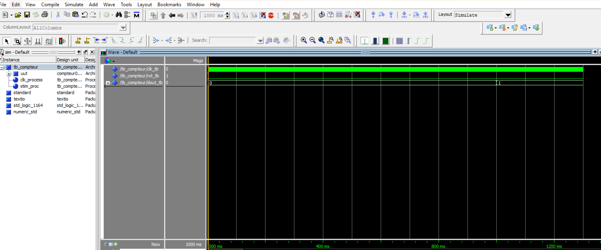
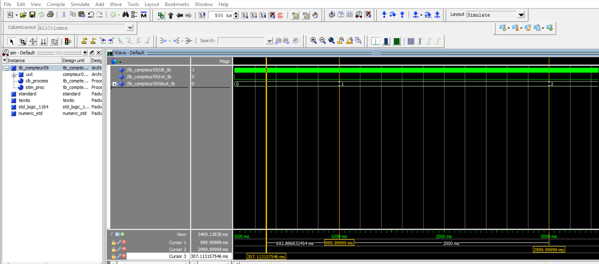

# Codesign - CESI

## Support de TP

> 📚 [Support de cours - Notion](https://chief-violin-c20.notion.site/TP-VHDL-Codesign-2026-2be3b9c822568011b904e0d58f24585e)

## Exercice 3 - Compteur synchrone 0 -> 9 avec periode de 1 seconde

**Objectif**  
Realiser un compteur synchrone **0 -> 9** avec une incrementation toutes les **1 seconde**.

### Solution

Ajout d'un **diviseur d'horloge**:

- Entree: 50 MHz
- Sortie: 1 Hz

Le compteur est pilote par cette horloge lente.

Validation:

- Compteur fonctionnel.
- Simulation possible.
- Pret pour implementation sur la carte DE0-Nano.

Observation de simulation:

- `dout_tb` passe de 0 -> 1 -> 2.
- Le changement se fait toutes les ~1000 ms (1 seconde).

Conclusion:

- Le temps de comptage est bien de 1 s.
- Le compteur est synchrone.
- L'objectif de l'exercice est atteint.

Un diviseur d'horloge a ete ajoute afin de transformer l'horloge de la carte (50 MHz) en une horloge lente de 1 Hz.  
Le compteur 0 a 9 est pilote par cette horloge divisee, ce qui permet une incrementation toutes les 1 seconde.  
La simulation sous ModelSim montre que la sortie evolue de 0 a 9 avec un pas temporel de 1 s, validant le bon fonctionnement du compteur.

TB figure :

Avec reset :

compteur 0 a 9 pour 1secondes part 2:

shema_pushBotton:

## Outils utilises

- Quartus Prime 18
- ModelSim
- Carte FPGA DE0-Nano

## Auteur

DBIBIH Oussama
