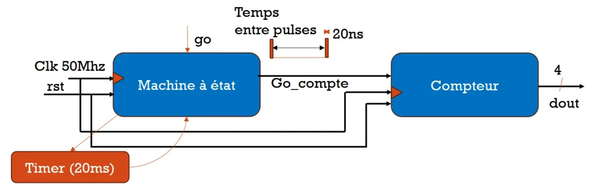
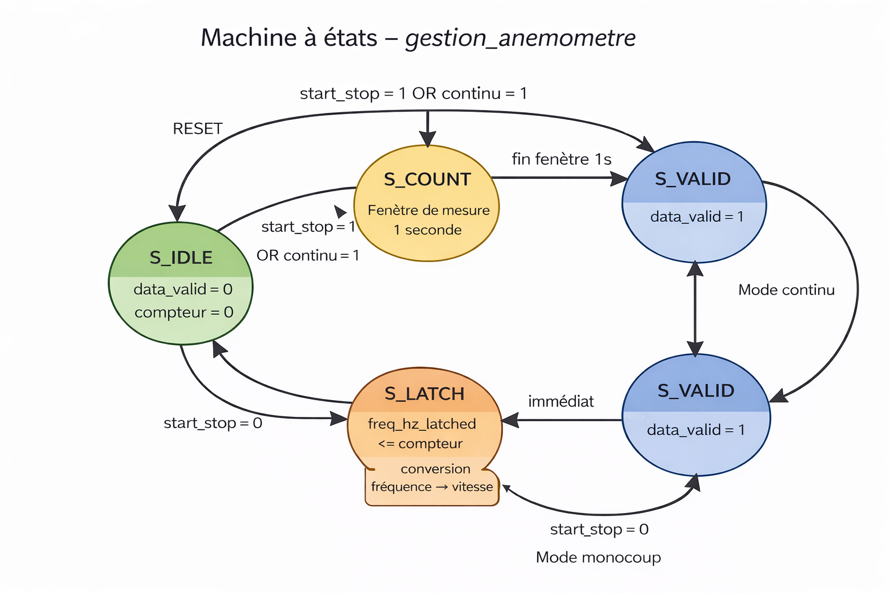
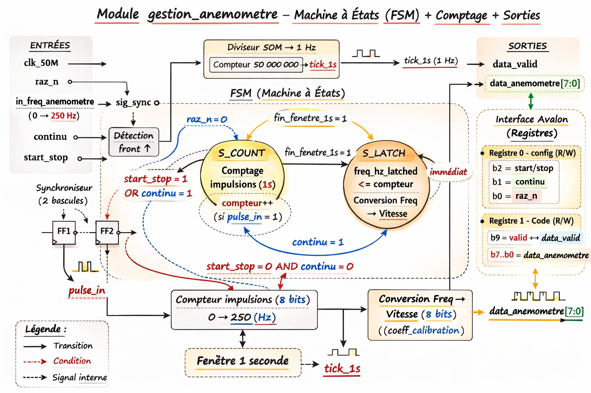

# Codesign – CESI

## 🔗 Lien vers le support Notion
https://chief-violin-c20.notion.site/TP-VHDL-Codesign-2026-2be3b9c822568011b904e0d58f24585e

---

## ✅ Prise en main de Quartus 18
✔ Terminée

---

## 🟦 Exercice 1 – Compteur 0 → 15

**Objectif :**  
Écrire en VHDL un compteur 4 bits allant de **0 à 15**, puis réaliser sa simulation.

**Livrables :**
- Code VHDL du compteur  
- Testbench de simulation  

✔ Exercice réalisé et validé

---

## 🟩 Exercice 2 – Compteur 0 → 9 + test sur DE0-Nano

**Objectif :**  
Modifier le compteur précédent pour qu'il compte de **0 à 9**.

### 🔧 Modification principale

Avant (0 → 15) :
```vhdl
if count = "1111" then   -- 15
    count <= (others => '0');
```
Après (0 → 9) :
```vhdl
if count = "1001" then   -- 9
    count <= (others => '0');
```

### 💡 Remarque (DE0-Nano)

La carte DE0-Nano utilise une horloge **clk_50MHz**, trop rapide pour observer le comptage sur les LEDs.  
Un ralentissement de l’horloge sera nécessaire pour un affichage visible.

✔ Même testbench utilisé pour les compteurs 0–15 et 0–9  
✔ Simulation validée avant test expérimental

---

## 🟥 Exercice 3 – Compteur synchrone 0 → 9 avec période de 1 seconde

**Objectif :**  
Réaliser un compteur synchrone **0 → 9** avec un incrément toutes les **1 seconde**.

### 🛠 Solution

Ajout d’un **diviseur d’horloge** :
- Entrée : 50 MHz  
- Sortie : 1 Hz  

Le compteur est alors piloté par cette horloge lente.

✔ Compteur fonctionnel  
✔ Simulation possible  
✔ Prêt pour implémentation sur la carte DE0-Nano

dout_tb passe de 0 → 1 → 2

avec un changement toutes les ~1000 ms (1 seconde):

    ✔ donc le temps de comptage est bien de 1 s

    ✔ le compteur est synchrone

    ✔ l’objectif de l’exercice est atteint

Un diviseur d’horloge a été ajouté afin de transformer l’horloge de la carte 50 MHz en une horloge lente de 1 Hz.
Le compteur 0 à 9 est piloté par cette horloge divisée, ce qui permet une incrémentation toutes les 1 seconde.
La simulation sous ModelSim montre que la sortie évolue de 0 à 9 avec un pas temporel de 1 s, validant le bon fonctionnement du compteur.


---

## exo 4


Le testbench vérifie le bon fonctionnement de la machine à états en testant le reset, les transitions entre etat1 et etat2, ainsi que le maintien dans un état lorsque l’entrée ne correspond pas à une transition valide.
Il valide également la priorité du reset, y compris lorsqu’il est appliqué pendant un changement d’état, et confirme **que la sortie out1 dépend uniquement de l’état présent (machine de Moore).**

Dans ton TB, tu as :
constant clk_period : time := 20 ns;
et :
    ck_tb <= '0'; wait for clk_period/2;
    ck_tb <= '1'; wait for clk_period/2;

    ➡️ Période = 20 ns
    ➡️ Fréquence = 1 / 20 ns = 50 MHz


---

## Exercice 5 : 
Programmer, simuler et tester le compteur asynchrone suivant :



**Cahier des charges :**
OK ✅ Exo5 = 1 incrémentation par appui sur go, avec anti-rebond 20 ms (clk = 50 MHz).
Le Compteur doit être incrémenté chaque fois que le bouton **go** est activé (afin d’éviter les rebonds du bouton le temps d’appui minimum est de 20ms)

Rmque : Une incrémentation par appui

l'idee:
une MAE détecte l’appui
un timer 20 ms valide que le bouton est bien stable
la MAE génère une impulsion go_compte d’un seul cycle d’horloge
le compteur incrémente uniquement sur cette impulsion
➡️ donc une incrémentation par appui, même si tu gardes le bouton appuyé.

**Ce que tu dois observer (validation Exo5)**

Si tu appuies une fois sur go (même longtemps) → dout fait +1 une seule fois
Les rebonds (impulsions rapides < 20ms) → ignorés
Si tu veux, je te fais aussi un testbench Exo5 où je simule des rebonds (go qui “tremble” pendant 5ms puis se stabilise) pour prouver que ça n’incrémente qu’une fois.


On vas coder 3 file:
compteur_en : Compteur 4 bits incrémenté par impulsion (enable)
mae_go_20ms: MAE + Timer 20 ms + impulsion go_compte
exo5: TOP : MAE + Compteur


👉 C’est quoi idle ?

idle = état d’attente / repos

**pour 20 ms**


---

## Exercice 6 : 
Réaliser le SOPC sopc_compteur, test expérimental sur carte DE0 Nano.
**Conception des SOC/SOPC (Platform Designer)**

- **Utilisation de Platform Designer pour la conception de SOPC (System On Programmable Chip)SOPC**
    
    Développement matériel HARD         Développement logiciel SOFT
    
    Q18 + Plateform Designer                   NIOS II (processeur softcore)
    
    (Q11 + SOPC Builder)
    
    **Platform Designer** permet, entre autres, de concevoir des microcontrôleurs spécifiques à une application. Ces microcontrôleurs comportent donc une partie processeur (softcore NIOS II) à laquelle on associe des périphériques (PIO, Timers, UART, USB, composants propriétaires, ...) et de la mémoire. Cette dernière peut être embarquée dans le FPGA (on parle alors de RAM/ROM On Chip) ou à l’extérieur du composant FPGA.
    
    La partie microprocesseur proprement dite est le softcore NIOS II de INTEL, processeur de 32 bits qui se décline en trois versions : économique, standard, rapide. La version économique, la moins puissante, utilise le moins de ressources du FPGA. Bien sûr il est possible d’intégrer d’autres types de processeurs pour peu qu’on dispose de leurs modèles (VHDL, Verilog, ...).
    
- La création d’une application SOPC comprend les étapes suivantes :
    
    1) Création du composant matériel (processeur + périphériques) dans l’environnement Quartus II.
    
    2) Eventuellement simulation avec l’outil Modelsim.
    
    3) Téléchargement dans le composant FPGA (configuration) (environnement Quartus II).
    
    4) Création du logiciel dans l’environnement NIOS2IDE, téléchargement dans le FPGA et débogage.

**Partie 2 : Développement logiciel**
*Hello world et PWM*

hello world -> VALIDE [OK]

---

## Partie 3 : 
lien : https://chief-violin-c20.notion.site/TP-VHDL-Codesign-2025-45ad154132b3417b96d6bfab48f48d36

**Intégration d’un composant propriétaire**


PWM -> VALIDE [OK]

ajoute photo tel

---
## Spécifications circuit acquisition vitesse vent


**Top Level**

photo tel

**MAE**
<!--  -->





---

## 📁 Outils utilisés
- Quartus Prime 18
- ModelSim
- Carte FPGA DE0-Nano
