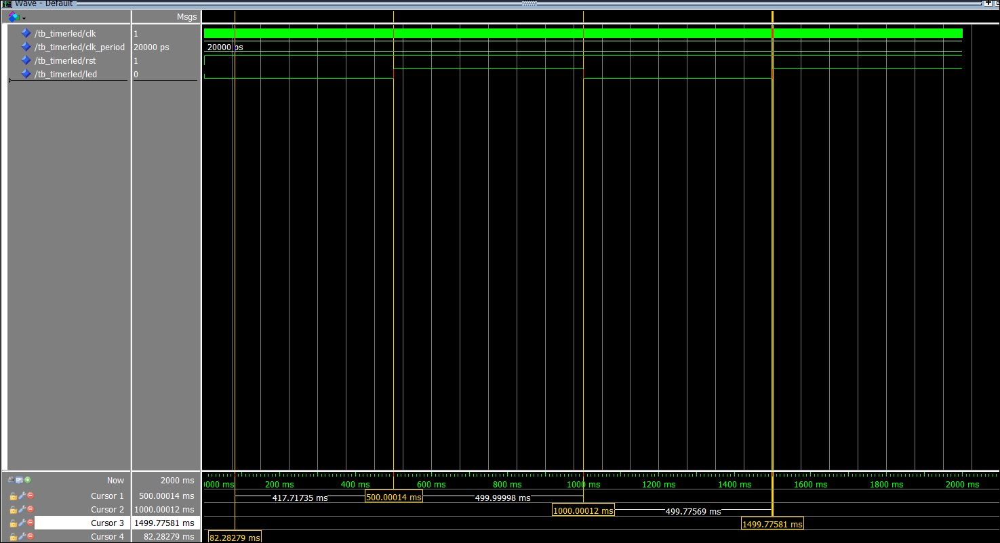

# Codesign - CESI
## Support de TP

[](https://www.intel.com/)
[](https://)

> 📚 [Support de cours - Notion](https://chief-violin-c20.notion.site/TP-VHDL-Codesign-2026-2be3b9c822568011b904e0d58f24585e)

## Prise en main de Quartus 18

### Statut: terminee

## 🎯 Objectif

Ce module VHDL réalise un **diviseur de fréquence** permettant de transformer l’horloge de la carte **DE0-Nano** (50 MHz) en un signal lent d’environ **1 Hz** afin de faire clignoter une LED toutes les secondes.

La synthèse est réalisée avec **Quartus Prime**.

---

## ⚙️ Principe de fonctionnement

### 1️⃣ Generic `max`

```vhdl
generic( max : natural := 25000000 );
```

* 50 MHz = 50 000 000 cycles par seconde
* Pour obtenir 1 Hz, on bascule la LED toutes les **25 000 000 périodes**
* Donc :

  * 25M cycles → inversion LED
  * 2 × 25M cycles = 50M cycles → 1 seconde complète

Cela crée une période totale de 1 seconde → LED clignote à 1 Hz.

---

### 2️⃣ Process (clk, rst)

```vhdl
process(clk, rst)
```

* `clk` : horloge 50 MHz
* `rst` : reset asynchrone actif bas

---

### 3️⃣ Reset asynchrone

```vhdl
if rst='0' then
```

* LED éteinte
* compteur `temp` remis à 0
* état interne `tout` remis à 0

---

### 4️⃣ Comptage

```vhdl
elsif rising_edge(clk) then
```

À chaque front montant :

* `temp` s’incrémente
* Lorsque `temp = max` :

  * `temp` revient à 0
  * la LED change d’état (`not tout`)

---

### 5️⃣ Résultat

La LED :

* change d’état toutes les 0,5 s
* clignote complètement toutes les 1 s

👉 C’est donc un **diviseur d’horloge 50 MHz → 1 Hz**



### 🎯 VALIDATION [OK]

## Outils utilises

- Quartus Prime 18
- ModelSim
- Carte FPGA DE0-Nano


## Auteur

DBIBIH Oussama